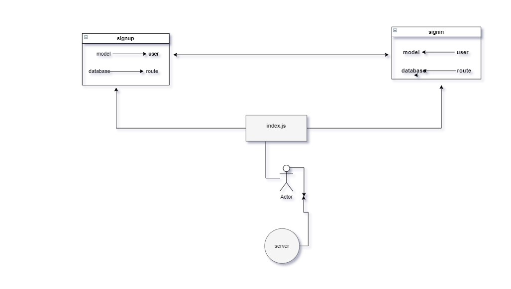

# bearer-auth

# basic-auth

## uml :

* [GitHub Repo Link](https://github.com/MAMOUN-kamal-alshisani/bearer-auth)

* [Pull Request](https://github.com/MAMOUN-kamal-alshisani/bearer-auth/pull/1)

* [Heroku Link](https://bearerauth1.herokuapp.com/) 

##### Setup
.envre quirements
  * PORT - Port Number

**Running the app**
* `npm start`
* Endpoints:
* ##### 1 -  `/status`

***Returns Object***

>[{
"id": 1,
"userName": "mamoun",
"userPassword": "0000",
"createdAt": "",
"updatedAt": ""
},

**Tests**
***Unit Tests: npm run test***
